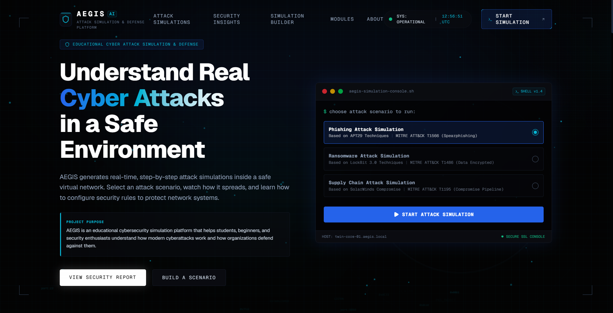
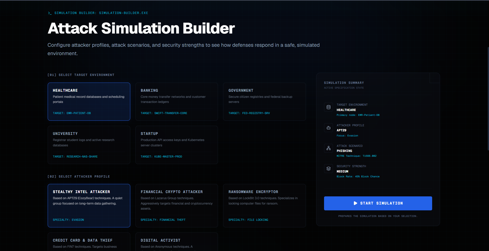
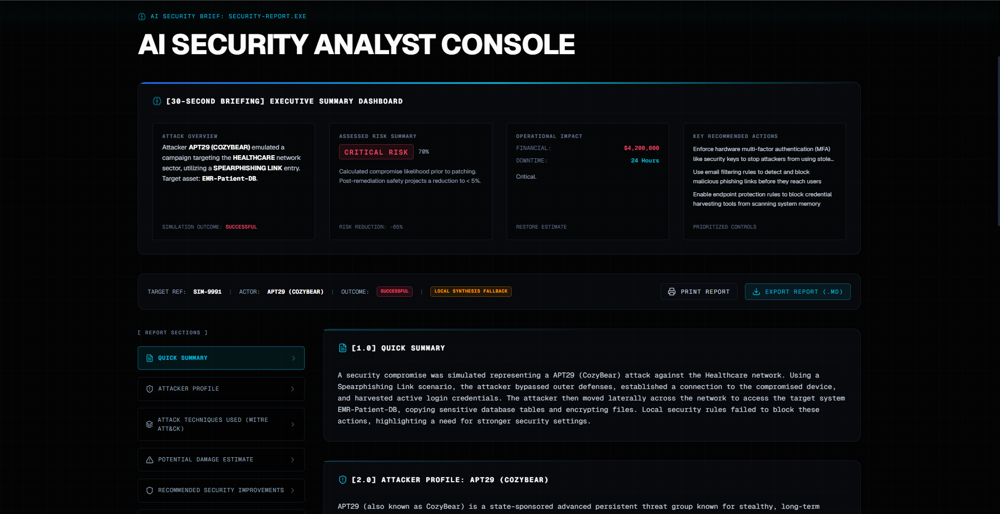
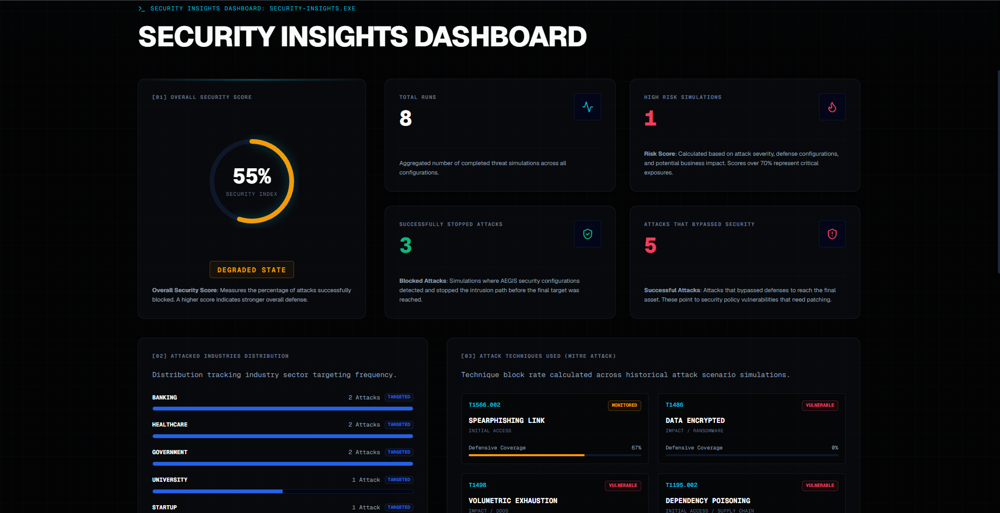

# 🛡️ AEGIS

### Understanding Cyber Attacks Through Simulation

AEGIS is an interactive cybersecurity simulation platform designed to make complex cyber attacks easier to understand.

Most people learn cybersecurity through diagrams, slides, and theory. AEGIS takes a different approach.

Instead of reading about phishing, ransomware, credential theft, or lateral movement, users can step into a simulated environment, launch attack scenarios, analyze the results, and explore how defensive decisions affect outcomes.

The objective is simple:

**Make cybersecurity visual, interactive, and approachable.**

---

## Why AEGIS Exists

When I started learning cybersecurity, I noticed that most educational resources focused on explaining attacks rather than helping people truly understand them.

Terms like:

* Spearphishing
* Initial Access
* Privilege Escalation
* Data Exfiltration
* MITRE ATT&CK

often felt disconnected from what actually happens during an attack.

AEGIS was built to bridge that gap.

It transforms cyber attack concepts into an experience where users can see how attacks unfold, why defenses fail, and what security teams can do differently.

---

## What You Can Do

### Build Attack Scenarios

Choose a target environment, attacker profile, attack technique, and security configuration.

Watch how different combinations produce different outcomes.

---

### Explore Security Reports

Every simulation generates a detailed analyst-style report containing:

* Executive summaries
* Threat profiles
* Attack progression
* Risk assessments
* Business impact estimates
* Defensive recommendations

---

### Visualize Security Posture

AEGIS tracks historical simulation outcomes and converts them into actionable metrics.

Users can review:

* Security scores
* Attack success rates
* Vulnerable attack techniques
* Defensive coverage
* Industry targeting trends

---

### Learn Through Experimentation

The platform encourages curiosity.

What happens when defenses are weak?

What changes when security controls improve?

How does ransomware differ from phishing?

How much damage can a successful attack cause?

Instead of reading answers, users discover them.

---

## Platform Preview

### Landing Experience

---

### Attack Simulation Builder

---

### AI Security Analyst Console

---

### Security Insights Dashboard

---

## Built With

* Next.js
* React
* TypeScript
* Tailwind CSS
* Framer Motion
* Vercel

---

## What I Learned

Building AEGIS challenged me far beyond writing code.

It pushed me to think about:

* User experience
* Cybersecurity storytelling
* System design
* Technical communication
* Interface design
* Performance optimization
* Security education

The most interesting part wasn't building the simulator.

It was figuring out how to make cybersecurity understandable for someone seeing these concepts for the first time.

---

## Future Vision

AEGIS is currently focused on cybersecurity education.

Future versions may include:

* AI-generated attack scenarios
* Interactive attack timelines
* Team-based simulations
* Threat intelligence integration
* Custom report generation
* PDF exports
* Scenario sharing

The long-term goal is to evolve AEGIS into a complete cybersecurity learning experience that combines simulation, visualization, and AI-assisted analysis.

---

## About The Developer

Hi, I'm **Utkarsh Singh**.

I'm an Electronics & Communication Engineering student at JIIT Noida with a growing interest in cybersecurity, software development, and building products that make technical concepts easier to understand.

AEGIS represents my effort to combine those interests into a single project.

If you found the project interesting, feel free to connect, provide feedback, or contribute ideas.

---

⭐ If you enjoyed exploring AEGIS, consider starring the repository.
